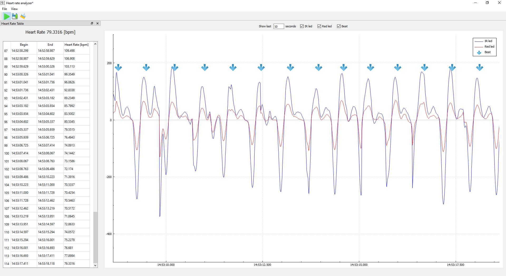
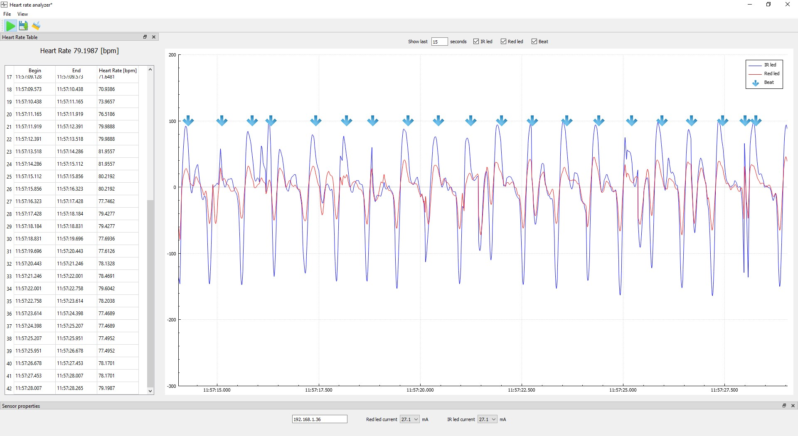
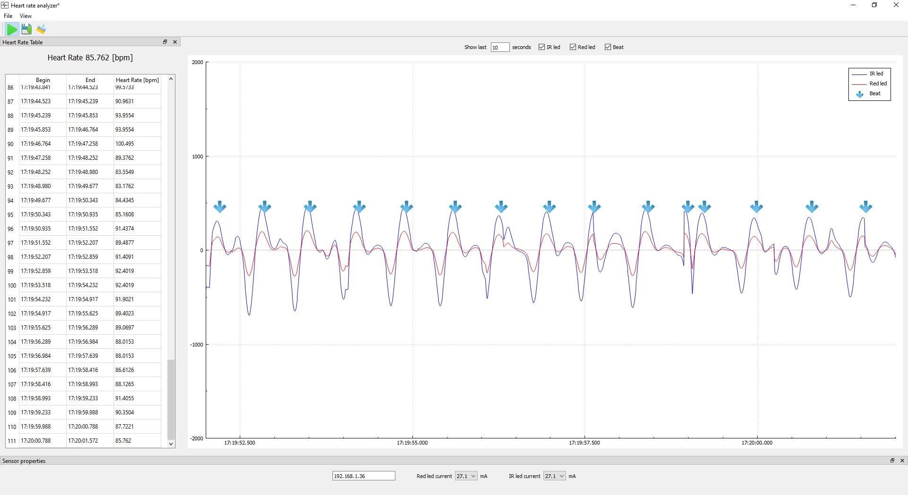
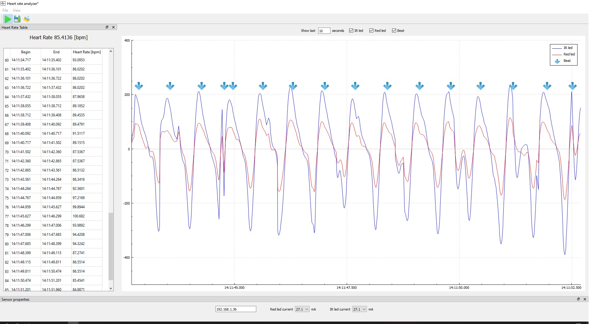
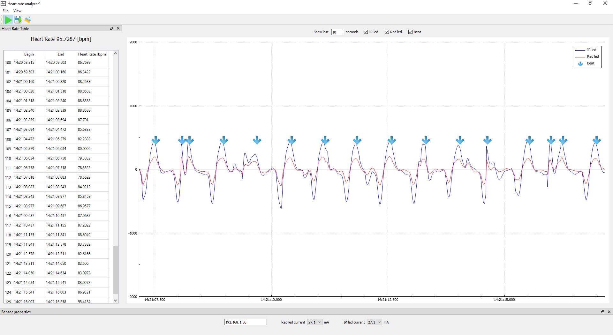
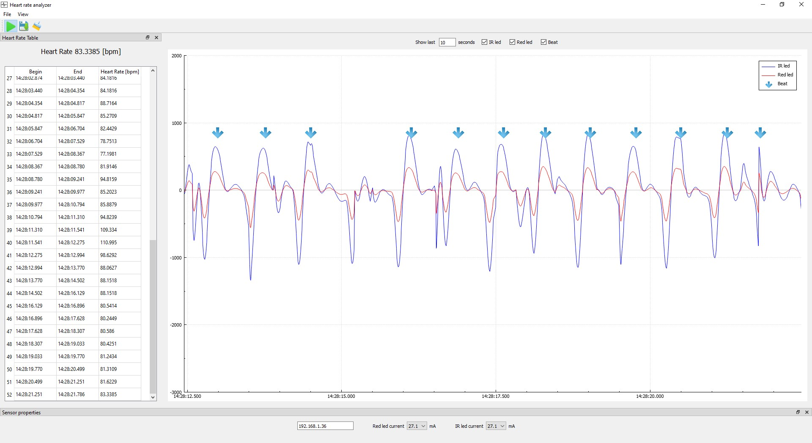
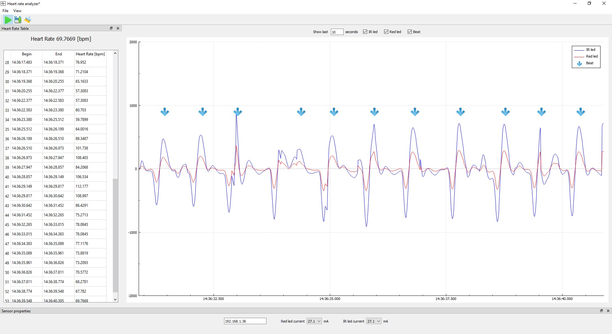
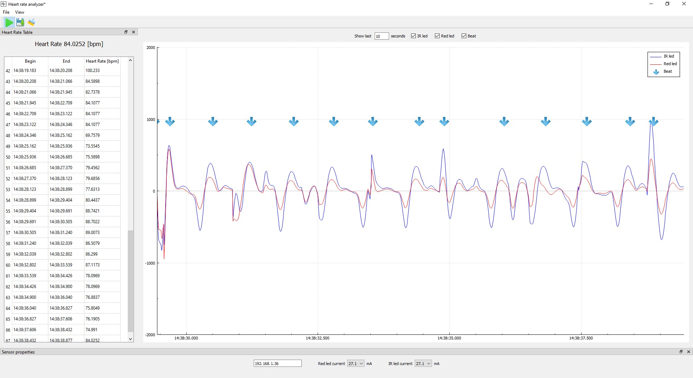

# Pulsometr
### Opis
Projekt został oparty o czujnik MAX30100. Program na ESP8266 został napisany w języku C++.
Różnież aplikacja na komputer została napisana w tym języku, oraz framework Qt.
Dodatkowo użyte zostały następujące biblioteki:
* [nlohmann/json] 
* [QCustomPlot]
* [IIR realtime filter]
* [OpenXLSX] 
* [Arduino-MAX30100]

## Pomiary
Ponieżej zamiesczono wyniki pomiarów z podziałem na 3 grupy, względem sposobu wyznaczania pulsu.
Do filtrowania sygnału użyto filtru psamowoprzepustowego, rzędu drugiego,
o dolnej częstotliwości 1.4Hz oraz górnej 6Hz.
Sygnał próbkowany z częstotliwością 100Hz.

### Puls jako średnia 10 próbek
Wyznaczana w ten sposób wartość pulsu cechowała się dużą wrażliwością na błędne decycje detektora
okresu sygnału.

Osoba 1

### Puls jako średnia 4 spośród 10 wartości
Wartość pulsu wyznaczana w tym przypadku była jako średnia 4 z 10 próbek.
Trzy minimalne i maksymalne próbki były odrzucane.
Uzyskano dzięki temu eliminację próbek będących wynikiem błędnych decyzji detektora.

Osoba 1

### Puls jako średnia 5 spośród 7 wartości
Ostatecznie zastosowano eliminację wartości maksynalnej i minimalnej w zbiorze 7 ostatnich
wartości. 

Osoba 1

Osoba 2

Osoba 3

Osoba 4

Osoba 5

Osoba 6

[nlohmann/json]: <https://github.com/nlohmann/json>
[QCustomPlot]: <https://www.qcustomplot.com/>
[IIR realtime filter]: <https://github.com/berndporr/iir1>
[OpenXLSX]: <https://github.com/troldal/OpenXLSX>
[Arduino-MAX30100]: <https://github.com/oxullo/Arduino-MAX30100>
